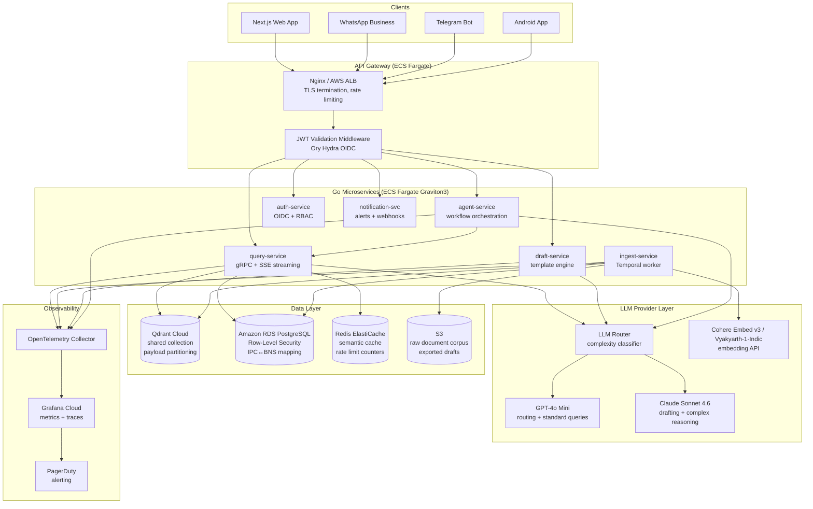

# Indian Legal GPT — Technical Architecture

> Version: 1.0 | Date: 2026-04-02  
> Team: 2–3 senior engineers | Infrastructure: AWS ap-south-1 (Mumbai)

---

## 1. System Overview



---

## 2. Go Service Decomposition

### 2.1 query-service

**Responsibility:** Core RAG orchestration — embedding, hybrid retrieval, context assembly, LLM completion, SSE streaming.

**API Surface:**
```
POST   /api/v1/query          → SSE stream: legal question → cited answer
POST   /api/v1/query/sync     → JSON: synchronous (non-streaming) query
GET    /api/v1/collections    → list available statute collections
GET    /api/v1/health         → service health check
```

**gRPC (internal):**
```
rpc QueryStream(QueryRequest) returns (stream QueryToken)
rpc EmbedQuery(EmbedRequest) returns (EmbedResponse)
```

**Data Ownership:** Reads from Qdrant (vectors), PostgreSQL (IPC↔BNS mapping, user query history). Writes to PostgreSQL (query_history). Reads Redis (cache).

**Scaling:** Horizontal; stateless. Bounded concurrency via `conc.ContextPool` (default: 50 concurrent RAG pipelines per pod). CPU-bound on embedding; I/O-bound on Qdrant and LLM calls.

**Key Libraries:**
- `sourcegraph/conc` — structured concurrency, goroutine pool
- `ristretto` — in-memory LRU cache (L1)
- `go-redis/v9` — Redis client for L2 semantic cache
- `qdrant/go-client` — Qdrant gRPC client

---

### 2.2 ingest-service

**Responsibility:** Document acquisition, normalization, chunking (SAC), embedding, Qdrant upsert, deduplication.

**API Surface (Temporal Workflows):**
```
Workflow: IngestDocumentWorkflow(source, doc_id, metadata)
  Activities: Acquire → Validate → Normalize → PIIDetect → Deduplicate → Chunk → Embed → Upsert → Verify → Notify
Workflow: IncrementalJudgmentIngestion(date_range)
  Activities: FetchDelta → FilterNovel → IngestDocumentWorkflow (fan-out)
```

**HTTP (admin only):**
```
POST /admin/ingest/trigger    → trigger manual ingestion run
GET  /admin/ingest/status     → DAG run status
```

**Data Ownership:** Reads from S3 (raw docs). Writes to Qdrant (vectors + metadata), PostgreSQL (dedup_ledger, ingestion_runs), S3 (normalized docs).

**Scaling:** Worker-based; scale Temporal workers horizontally. Embedding API calls are the bottleneck — rate limit Cohere/Vyakyarth calls via token bucket.

---

### 2.3 draft-service

**Responsibility:** Legal document generation using LLM + retrieved context. Template management. BCI compliance enforcement.

**API Surface:**
```
POST /api/v1/draft/generate   → generate draft from template + context
POST /api/v1/draft/revise     → iterate on existing draft
GET  /api/v1/draft/templates  → list available templates
POST /api/v1/draft/export     → export to PDF/DOCX (triggers BCI review checkpoint)
```

**gRPC (internal):**
```
rpc GenerateDraft(DraftRequest) returns (stream DraftToken)
rpc ExportDraft(ExportRequest) returns (ExportResponse)
```

**Data Ownership:** Reads from PostgreSQL (templates, user drafts). Writes to PostgreSQL (draft_history), S3 (exported PDFs). Calls query-service for context retrieval.

**BCI Compliance Enforcement:** Export endpoint requires `review_acknowledged: true` in request body. This flag is only settable by the frontend after the user checks the mandatory review checkbox. Backend enforces at API level — export without acknowledgment returns HTTP 403.

**Scaling:** Stateless; scale horizontally. Long-running draft generation uses SSE streaming.

---

### 2.4 agent-service

**Responsibility:** Multi-step legal workflow orchestration. Audit trail. Safety enforcement.

**API Surface:**
```
POST /api/v1/agent/run        → start an agent workflow
GET  /api/v1/agent/{id}/status → poll workflow status
GET  /api/v1/agent/{id}/audit → retrieve full audit trail
POST /api/v1/agent/{id}/approve → human approval for staged output
```

**Safety Architecture:**
- System prompt injected via `system` field — never concatenated with user input
- Input sanitizer runs before any agent step
- All tool calls enumerated in agent config — non-whitelisted calls halt the agent
- All outputs go to `agent_staging` table — no direct external writes
- Human approval required to move from staging → exported document

**Audit Trail Schema:**
```sql
CREATE TABLE agent_audit_log (
    id           UUID PRIMARY KEY,
    agent_id     UUID NOT NULL,
    session_id   UUID NOT NULL,
    step         INT NOT NULL,
    action       TEXT NOT NULL,
    input_hash   CHAR(64) NOT NULL,  -- SHA-256
    output_hash  CHAR(64) NOT NULL,
    tool_called  TEXT,
    status       TEXT NOT NULL,       -- 'ok', 'halted', 'rejected'
    created_at   TIMESTAMPTZ NOT NULL DEFAULT NOW()
);
-- Append-only enforced via trigger: no UPDATE or DELETE allowed
```

**Scaling:** Long-running workflows use Temporal for durability. Stateless HTTP API.

---

### 2.5 auth-service

**Responsibility:** Identity (OIDC via Ory Hydra), JWT issuance, RBAC, tenant management.

**API Surface:**
```
POST /auth/token              → issue JWT (short-lived, 15 min)
POST /auth/refresh            → rotate refresh token (HttpOnly cookie)
POST /auth/logout             → revoke refresh token
GET  /auth/userinfo           → OIDC userinfo endpoint
POST /admin/tenants           → create tenant (admin only)
PUT  /admin/tenants/{id}/tier → upgrade tenant tier
```

**JWT Claims:**
```json
{
  "sub": "user-uuid",
  "tenant_id": "tenant-uuid",
  "role": "pro",
  "query_remaining": 847,
  "exp": 1712345678
}
```

**Rate Limit Enforcement:** Redis counter `rate:tenant:{tenant_id}:queries:{YYYYMM}` incremented on every query. Free tier: hard cap at 15/month. Pro tier: 500/month. Enterprise: configurable.

**Scaling:** Stateless; Ory Hydra handles session state in PostgreSQL.

---

### 2.6 notification-svc

**Responsibility:** Regulatory change alerts, hearing reminders, case status updates, knowledge staleness notifications.

**API Surface:**
```
POST /api/v1/notifications/subscribe   → subscribe to practice area / case alerts
GET  /api/v1/notifications             → list user notifications
POST /admin/notifications/broadcast    → broadcast regulatory update (admin)
```

**Event Sources:** Temporal workflows publish to internal event bus (Redis Streams) when new judgments/gazette notifications are ingested. notification-svc subscribes and fans out to relevant users.

**Scaling:** Event-driven; stateless consumers. Redis Streams provides durable delivery.

---

## 3. RAG Pipeline Specification

### 3.1 Chunking Strategy: Summary-Augmented Chunking (SAC)

**For statutes (BNS, BNSS, BSA, Constitution):**

Hierarchical structure parsed: `Act → Part → Chapter → Section → Sub-section → Clause`

For each leaf node (sub-section or clause), the chunk stored in Qdrant is:

```
[PARENT SUMMARY]
Act: Bharatiya Nyaya Sanhita, 2023
Chapter: III — Offences Against the Human Body
Section 103: Punishment for murder
Summary: Section 103 defines murder as an act under Section 101 and prescribes punishment of death or imprisonment for life plus fine. Exception clauses reduce culpability under specific conditions.

[CHUNK CONTENT]
103. Punishment for murder.—Whoever commits murder shall be punished with death or with imprisonment for life, and shall also be liable to fine.
```

**Justification:** Without the parent summary prepended, a chunk containing only "shall also be liable to fine" has no recoverable meaning when retrieved by vector similarity. The summary preserves legislative intent without requiring the full parent text in every chunk.

**For judgment prose:**

Sliding window: 512 tokens, 128-token overlap. Metadata extraction: case name, citation, bench, date, statutes cited, outcome.

**Chunk size:** ~400–600 tokens (leaves room for parent summary + LLM context window budget).

---

### 3.2 Hybrid Retrieval Design

```
Query: "What is the punishment for murder under BNS?"

Step 1: Query Embedding
  - Embed query via Cohere Embed v3 (input_type="search_query")
  - Result: query_vector [1024 dimensions]

Step 2: Intent Classification
  - Detect old statute references (IPC, CrPC, Evidence Act) in query text
  - If detected: query PostgreSQL ipc_bns_mapping → inject exact BNS equivalent as system constraint
  - Query: "IPC 302" → mapping lookup → "BNS 103" injected

Step 3: Parallel Retrieval
  - Dense: Qdrant ANN search (HNSW), top-20 results, filtered by tenant_id payload
  - Sparse: BM25 keyword search on statute + section text, top-20 results
  - Merge: reciprocal rank fusion (RRF) → top-30 combined candidates

Step 4: Cross-Encoder Reranking
  - Cohere Rerank v3 (or BAAI/bge-reranker-v2-m3 self-hosted)
  - Input: query + top-30 candidate chunks
  - Output: reranked top-8 with relevance scores

Step 5: Staleness Check
  - For each of top-8 chunks: check superseded_by field
  - If non-null: flag chunk as stale, include in context but set staleness_warning

Step 6: Context Assembly (token budget: 3,500 tokens)
  - Inject top reranked chunks in order of relevance score
  - For each chunk: include immediate hierarchical parent node if budget allows
  - Reserve 500 tokens for system prompt + query
  - Reserve 1,000 tokens for LLM output
```

**Pseudocode — Context Assembly:**

```go
func AssembleContext(chunks []RankedChunk, budget int) string {
    used := 0
    var parts []string
    for _, chunk := range chunks {
        chunkTokens := EstimateTokens(chunk.Text)
        if used + chunkTokens > budget { break }
        parts = append(parts, chunk.Text)
        used += chunkTokens
        // Include parent node if budget allows
        parentTokens := EstimateTokens(chunk.ParentSummary)
        if used + parentTokens <= budget {
            parts = append(parts, "Context: " + chunk.ParentSummary)
            used += parentTokens
        }
    }
    return strings.Join(parts, "\n\n---\n\n")
}
```

---

### 3.3 Hallucination Guardrail Design

**Layer 1 — Citation Grounding (Guardrails AI):**
Every LLM response is parsed to extract cited sections (e.g., "Section 103 BNS"). For each citation:
- Verify the section exists in the vector DB metadata
- Verify the section text was included in the context window for this query
- If either check fails → citation flagged as ungrounded → response marked with `hallucination_warning`

**Layer 2 — Confidence Threshold:**
RAGAS Faithfulness score computed per response. If score < 0.65:
```go
return Response{
    Content: "Insufficient authoritative context is available in the database to answer this legal query accurately. The retrieved statutes do not provide a definitive answer. Please consult a qualified advocate for this matter.",
    Abstained: true,
    ConfidenceScore: score,
}
```

**Layer 3 — Audit Logging:**
All abstention events logged with query hash to PostgreSQL `abstention_log` for golden set expansion.

---

## 4. LLM Provider Interface

```go
// File: query-service/llm/provider.go

package llm

import (
    "context"
    "time"
)

type Response struct {
    Content      string
    TokensIn     int
    TokensOut    int
    ModelUsed    string
    Latency      time.Duration
    FinishReason string
}

type Token struct {
    Text  string
    Done  bool
    Error error
}

type CompletionOptions struct {
    Model        string
    MaxTokens    int
    Temperature  float32
    SystemPrompt string
    StopSequences []string
}

// LLMProvider — the port. All LLM backends implement this interface.
type LLMProvider interface {
    Complete(ctx context.Context, prompt string, opts CompletionOptions) (Response, error)
    Stream(ctx context.Context, prompt string, opts CompletionOptions) (<-chan Token, error)
    Embed(ctx context.Context, texts []string) ([][]float32, error)
    Name() string
}

// --- OllamaProvider ---

type OllamaProvider struct {
    BaseURL string   // default: http://localhost:11434
    client  *http.Client
}

func (p *OllamaProvider) Name() string { return "ollama" }
// implements Complete, Stream, Embed via Ollama REST API

// --- AnthropicProvider ---

type AnthropicProvider struct {
    APIKey  string
    client  anthropic.Client  // github.com/anthropics/anthropic-sdk-go
}

func (p *AnthropicProvider) Name() string { return "anthropic" }
// implements Complete, Stream via Messages API; Embed via Cohere (Anthropic has no embedding API)

// --- OpenAIProvider ---

type OpenAIProvider struct {
    APIKey  string
    client  openai.Client  // github.com/openai/openai-go
}

func (p *OpenAIProvider) Name() string { return "openai" }
// implements Complete, Stream, Embed via OpenAI API

// --- LLM Router ---

type RouterConfig struct {
    StandardProvider  LLMProvider  // GPT-4o Mini — routing, standard queries
    PremiumProvider   LLMProvider  // Claude Sonnet — drafting, complex reasoning
    ComplexityThreshold float32    // 0.0–1.0; above threshold = premium
}

// Router selects provider based on query complexity score
type LLMRouter struct {
    cfg        RouterConfig
    classifier ComplexityClassifier
}

func (r *LLMRouter) Complete(ctx context.Context, prompt string, opts CompletionOptions) (Response, error) {
    complexity := r.classifier.Score(prompt)
    if complexity >= r.cfg.ComplexityThreshold {
        return r.cfg.PremiumProvider.Complete(ctx, prompt, opts)
    }
    return r.cfg.StandardProvider.Complete(ctx, prompt, opts)
}
```

**Config-driven selection** (`config.json` or environment):
```json
{
  "llm": {
    "provider": "router",
    "router": {
      "standard": "openai",
      "premium": "anthropic",
      "complexity_threshold": 0.7
    }
  }
}
```

**Concrete implementations:**
- `OllamaProvider` — POC/local dev; no API cost
- `AnthropicProvider` — Claude Sonnet 4.6 for drafting + complex legal reasoning
- `OpenAIProvider` — GPT-4o Mini for classification, standard statute lookup
- `LLMRouter` — wraps both; dispatches based on query complexity score

---

## 5. Caching Architecture

### Layer 1: In-Memory LRU (ristretto)

```go
cache, _ := ristretto.NewCache(&ristretto.Config{
    NumCounters: 1e7,     // ~10M keys tracked
    MaxCost:     1 << 30, // 1 GB max memory
    BufferItems: 64,
})
// Key: SHA-256(normalized_query_text + collection_ids + tenant_id)
// TTL: 1 hour for statute queries; 15 min for judgment queries
```

**Hit rate target:** 30%+ (legal queries are highly repetitive — same landmark cases, same BNS sections).

### Layer 2: Redis Semantic Cache

```go
// Key: base64(query_embedding_vector)
// Value: serialized Response JSON
// TTL: 6 hours statute; 2 hours judgments; 30 min regulatory circulars
// Match: compute cosine similarity between incoming query vector and stored keys
// Cache hit threshold: cosine ≥ 0.98
```

**Semantic key lookup** via Redis Vector Search (using Redis Stack / RediSearch module).

### Layer 3: Qdrant Query Result Cache

For common multi-statute queries, the top-K ANN results are cached in Redis with the query vector as key.
TTL: 30 minutes. Flushed on ingestion of new chunks in the relevant collection.

### Invalidation Triggers

| Event | Invalidation Scope |
|-------|-------------------|
| New gazette notification ingested | Flush Redis entries referencing affected statute sections |
| New SC/HC judgment ingested | Flush Redis entries referencing cited statutes in judgment |
| Statute `effective_date` updated | Flush all entries for that statute collection |
| User account deletion (DPDP) | Flush all Redis entries scoped to that tenant_id |

### TTL Policy

| Content Type | L1 (ristretto) | L2 (Redis) |
|-------------|---------------|-----------|
| Constitutional provisions | 24h | 48h |
| BNS/BNSS/BSA sections | 12h | 24h |
| SC judgments (historical) | 12h | 24h |
| Recent HC judgments (< 6 months) | 2h | 6h |
| Regulatory circulars | 30m | 2h |
| User-specific query history | No cache | No cache |

---

## 6. Multi-Tenancy & Data Isolation

### Qdrant Namespacing Strategy

**Architecture: Single shared collection with payload-based partitioning.**

```json
{
  "collection": "legal_corpus_v1",
  "vectors": { "size": 1024, "distance": "Cosine" },
  "payload_schema": {
    "tenant_id":    { "type": "keyword", "is_tenant": true },
    "statute":      { "type": "keyword" },
    "section":      { "type": "keyword" },
    "effective_date": { "type": "datetime" },
    "superseded_by": { "type": "keyword" },
    "language":     { "type": "keyword" }
  }
}
```

Every vector point is tagged with `tenant_id`. For public statutes (BNS, Constitution): `tenant_id = "public"`. For tenant-specific uploaded documents: `tenant_id = "<tenant_uuid>"`.

**All Qdrant queries include a mandatory filter:**
```json
{
  "filter": {
    "should": [
      { "key": "tenant_id", "match": { "value": "public" } },
      { "key": "tenant_id", "match": { "value": "<current_tenant_uuid>" } }
    ]
  }
}
```

This filter is injected in the query-service Go code and cannot be bypassed by API callers.

### Crossover Threshold: When to Use Dedicated Shards

| Condition | Strategy |
|-----------|----------|
| < 50 enterprise tenants, < 5M vectors | Shared collection + payload partitioning |
| Enterprise tenant uploads > 500K proprietary documents | Trigger Tenant Promotion → dedicated shard |
| Enterprise SLA requires guaranteed QPS isolation | Dedicated shard (Qdrant Tiered Multitenancy) |

### Tenant Isolation by Tier

| Tier | Qdrant Isolation | PostgreSQL RLS | Rate Limit | On-prem Option |
|------|-----------------|---------------|-----------|---------------|
| Free | Shared collection, payload filter | Row-level policy | 15 queries/month | No |
| Pro | Shared collection, payload filter | Row-level policy | 500 queries/month | No |
| Enterprise | Dedicated shard (Tenant Promotion) | Row-level policy + dedicated schema | Configurable | Yes ($50K+/year) |

### PostgreSQL Row-Level Security

```sql
-- Enable RLS on all tenant-scoped tables
ALTER TABLE query_history ENABLE ROW LEVEL SECURITY;
ALTER TABLE saved_research ENABLE ROW LEVEL SECURITY;
ALTER TABLE draft_history ENABLE ROW LEVEL SECURITY;

-- Policy: users see only their tenant's rows
CREATE POLICY tenant_isolation ON query_history
    USING (tenant_id = current_setting('app.current_tenant_id')::uuid);

-- Set at connection time in Go:
-- db.Exec("SET app.current_tenant_id = $1", tenantID)
```

This guarantees that even if a Go service bug constructs an incorrect query, the PostgreSQL executor enforces tenant boundaries at the storage level.

---

## 7. Observability Stack

### OpenTelemetry Instrumentation

All Go services are instrumented with `go.opentelemetry.io/otel` from Phase 1.

**Trace spans per RAG query:**
```
query-service.HandleQuery
  └─ auth.ValidateJWT
  └─ cache.L1Lookup
  └─ cache.L2Lookup
  └─ llm.ClassifyComplexity
  └─ retrieval.EmbedQuery      [latency: embedding API]
  └─ retrieval.QdrantANN       [latency: vector search]
  └─ retrieval.BM25Sparse      [latency: keyword search]
  └─ retrieval.Rerank          [latency: cross-encoder]
  └─ context.Assemble
  └─ guardrails.CheckStaleness
  └─ llm.Complete / llm.Stream [latency: LLM TTFT]
  └─ guardrails.ValidateCitations
  └─ cache.WriteL2
```

### Key Metrics

| Metric | Type | Alert Threshold |
|--------|------|----------------|
| `rag.query.latency` (p50/p95/p99) | Histogram | p95 > 8s → page |
| `llm.ttft` (time-to-first-token, p50/p95) | Histogram | p95 > 3s → warn |
| `embedding.throughput` (tokens/sec) | Gauge | < 1000 tokens/s → warn |
| `qdrant.ann_latency` (p50/p95) | Histogram | p95 > 500ms → warn |
| `qdrant.query_latency` (e2e) | Histogram | p99 > 2s → warn |
| `cache.hit_rate.l1` | Gauge | < 20% → investigate |
| `cache.hit_rate.l2` | Gauge | < 30% → investigate |
| `llm.error_rate` | Counter | > 1% → page |
| `abstention.rate` | Gauge | > 30% → pipeline regression |
| `hallucination.flagged_rate` | Gauge | > 5% → page |
| `ingest.lag_seconds` | Gauge | > 3600s (1 hour) → warn |

### Latency Budget (Phase 5 target: < 2s p50)

| Component | Budget |
|-----------|--------|
| API Gateway + JWT validation | 50ms |
| L1 cache lookup (ristretto) | 1ms |
| L2 cache lookup (Redis) | 10ms |
| Query embedding (Cohere API) | 200ms |
| Qdrant ANN search | 100ms |
| BM25 sparse search | 30ms |
| Cross-encoder rerank (Cohere) | 150ms |
| Context assembly + DB lookup | 50ms |
| LLM TTFT (GPT-4o Mini) | 600ms |
| Network overhead + TLS | 200ms |
| **Total (cache miss)** | **~1,391ms** |

### Grafana Dashboards

- **RAG Quality Dashboard:** RAGAS scores over time, abstention rate, hallucination rate
- **Latency Dashboard:** p50/p95/p99 for each pipeline stage
- **Cost Dashboard:** LLM token consumption per provider, cost per query by tier
- **Ingestion Dashboard:** DAG run status, dedup rate, new chunks/hour

### Alert Runbooks (stored in `/docs/runbooks/`)

| Alert | Runbook |
|-------|---------|
| LLM error rate > 1% | `runbooks/llm_api_errors.md` — check provider status, rotate keys |
| Qdrant latency spike | `runbooks/qdrant_latency.md` — check payload index, cluster health |
| Abstention rate > 30% | `runbooks/eval_regression.md` — run RAGAS suite, check last ingestion run |
| RDS CPU > 80% | `runbooks/rds_scaling.md` — check slow queries, consider read replica |

---

*Architecture Version 1.0 — Review scheduled at end of Phase 2 to incorporate production learnings.*
